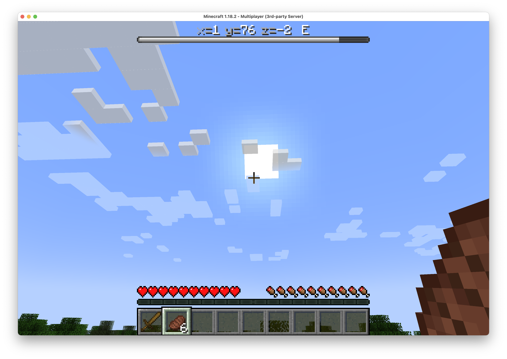

# Lodestar

Use Minecraft's "Boss Bar" to show player information:

* Current coordinates
* Compass direction facing
* Progress bar with remaining amount of day or night



# Building

```
mvn clean ; mvn package
```

# Install

```
cp target/Lodestar-1.0.0.jar ~/minecraft/plugins/
```

(change target dir accordingly)

# Etc

Created by [harrison.page](https://harrison.page) on 2-Apr-2022
